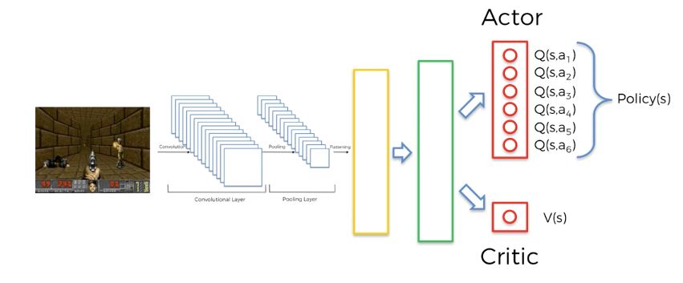
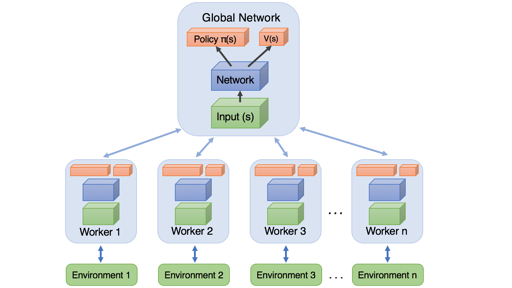
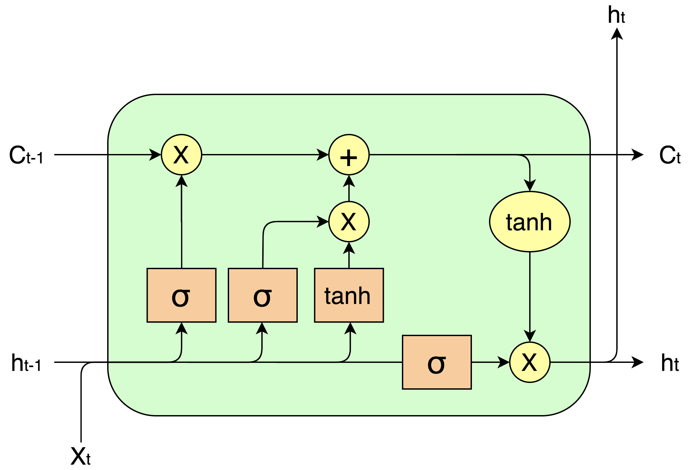

# Module-3-A3C-LSTM
Implémentation A3C + LSTM

## 🎮 Introduction

Dans ce module, nous implémentons une combinaison de techniques avancées en apprentissage par renforcement pour entraîner un agent à résoudre des tâches complexes. Cette implémentation repose sur deux concepts clés : **A3C** (Actor-Critic Asynchronous Advantage) et **LSTM** (Long Short Term Memory).

- **A3C** : Actor-Critic Asynchronous Advantage
- **LSTM** : Long Short Term Memory

---

## 🧠 A3C : Actor-Critic, Asynchronous, Advantage

### 1. Actor-Critic



L'architecture **Actor-Critic** repose sur deux parties principales :

- **L'acteur (Actor)** : Cette partie prend une décision en choisissant l'action à effectuer dans un état donné. Elle utilise une fonction de politique pour générer un ensemble d'actions.
- **Le critique (Critic)** : Cette partie évalue la qualité de l'action choisie par l'acteur en estimant la valeur de l'état dans lequel se trouve l'agent.

Les valeurs **Q** de l’acteur sont appelées stratégie et sont parfois notées par la lettre grecque **π**. Ces valeurs sont utilisées pour guider l’acteur dans ses choix d’actions.

### 2. Asynchronous

Le concept **Asynchronous** (Asynchrone) permet à plusieurs agents d'interagir avec l'environnement en même temps. Chaque agent commence à un point différent de l'environnement et apporte ses connaissances aux autres agents via le réseau partagé. Cette approche améliore l'exploration et réduit le risque d'overfitting ou de stagnation dans certaines parties de l'environnement.



Les agents partagent un réseau neuronal, qui génère des politiques (acteurs) et des critiques. En cas de mise à jour des poids du réseau, tous les agents partagent les mêmes poids, mais leurs actions sont distinctes et basées sur les contextes spécifiques de chaque agent.

### 3. Advantage

L’**avantage** (Advantage) représente la différence entre la **valeur de l’état** (estimée par le critique) et la **valeur d’action** choisie. Cet avantage est utilisé pour ajuster les décisions de l’acteur et améliorer ses actions futures. 

L’avantage est calculé avec l’équation suivante :
\[ \text{Advantage}(s, a) = Q(s, a) - V(s) \]
L’objectif est de maximiser l’avantage pour apprendre plus efficacement les bonnes actions.

La **perte de police** est utilisée pour inciter l'agent à choisir des actions positives, tandis que la **perte de valeur** est liée à l’évaluation de l’état (valeur de l’état).

### 4. LSTM : Long Short Term Memory




Le **LSTM** est une couche spécialisée dans les réseaux de neurones récurrents (RNN). Contrairement aux réseaux classiques, les LSTM possèdent une mémoire qui leur permet de se souvenir des actions passées et d'en tenir compte pour les décisions futures. Cela est particulièrement utile pour les environnements où la dynamique des états évolue au fil du temps, comme les jeux vidéo.

Dans cette implémentation, la couche **LSTMCell** est utilisée pour stocker les informations temporelles des observations successives. Elle remplace la couche cachée classique des réseaux de neurones pour capturer les dépendances temporelles et améliorer la performance de l’agent sur des tâches complexes.

---

## 🏗️ La Classe `ActorCritic`

La classe `ActorCritic` définit un réseau de neurones qui implémente la méthode **Actor-Critic** pour l'apprentissage par renforcement avec des observations sous forme d’images.

### Structure du modèle

Le modèle est composé de plusieurs couches :

- **4 couches de convolution (`conv1`, `conv2`, `conv3`, `conv4`)** : Ces couches sont responsables de l'extraction des caractéristiques visuelles de l’image d'entrée.
- **LSTMCell** : Une cellule LSTM qui capture les dépendances temporelles dans les données séquentielles.
- **Couches linéaires (`critic_linear` et `actor_linear`)** : 
  - `critic_linear` : Estime la valeur d’état.
  - `actor_linear` : Génère la distribution de probabilités pour les actions possibles.

### Initialisation des poids

Les poids sont initialisés pour stabiliser l'apprentissage :
- Les poids du **Critic** sont initialisés avec une variance plus large.
- Les poids de l'**Actor** sont initialisés avec des valeurs plus petites pour éviter des mises à jour brutales.
- Les biais de la LSTM et des couches linéaires sont initialisés à zéro.

### Fonction `forward`

La méthode `forward` définit le passage des données dans le réseau. Elle prend en entrée une observation sous forme de tenseur, ainsi que les états internes de la LSTM (hx, cx). Le flux des données se fait comme suit :

1. Passage des données d'entrée à travers les couches de convolution activées par la fonction **ELU**.
2. Les caractéristiques extraites sont envoyées dans la cellule LSTM pour capturer les relations temporelles.
3. La sortie de la LSTM est envoyée à travers les couches linéaires pour obtenir les prédictions :
   - **Critique** : Estime la valeur de l’état courant.
   - **Acteur** : Génère une distribution de probabilités pour les actions possibles.

### Code de la classe `ActorCritic`

```python
import torch
import torch.nn as nn
import torch.nn.functional as F

# Initialisation des poids pour stabiliser l'apprentissage
def weights_init(m):
    if isinstance(m, nn.Conv2d):
        nn.init.kaiming_normal_(m.weight, mode='fan_out', nonlinearity='relu')
    elif isinstance(m, nn.Linear):
        nn.init.xavier_normal_(m.weight)
    elif isinstance(m, nn.LSTMCell):
        nn.init.zeros_(m.bias_ih)
        nn.init.zeros_(m.bias_hh)

def normalized_columns_initializer(weights, std=1.0):
    shape = weights.shape
    out = torch.randn(shape) * std
    return out

class ActorCritic(torch.nn.Module):
    def __init__(self, num_inputs, action_space):
        super(ActorCritic, self).__init__()
        self.conv1 = nn.Conv2d(num_inputs, 32, 3, stride=2, padding=1)
        self.conv2 = nn.Conv2d(32, 32, 3, stride=2, padding=1)
        self.conv3 = nn.Conv2d(32, 32, 3, stride=2, padding=1)
        self.conv4 = nn.Conv2d(32, 32, 3, stride=2, padding=1)
        self.lstm = nn.LSTMCell(32 * 3 * 3, 256)
        num_outputs = action_space.n
        self.critic_linear = nn.Linear(256, 1)
        self.actor_linear = nn.Linear(256, num_outputs)
        self.apply(weights_init)
        self.actor_linear.weight.data = normalized_columns_initializer(self.actor_linear.weight.data, 0.01)
        self.actor_linear.bias.data.fill_(0)
        self.critic_linear.weight.data = normalized_columns_initializer(self.critic_linear.weight.data, 1.0)
        self.critic_linear.bias.data.fill_(0)
        self.lstm.bias_ih.data.fill_(0)
        self.lstm.bias_hh.data.fill_(0)
        self.train()

    def forward(self, inputs):
        inputs, (hx, cx) = inputs
        x = F.elu(self.conv1(inputs))
        x = F.elu(self.conv2(x))
        x = F.elu(self.conv3(x))
        x = F.elu(self.conv4(x))
        x = x.view(-1, 32 * 3 * 3)
        hx, cx = self.lstm(x, (hx, cx))
        x = hx
        return self.critic_linear(x), self.actor_linear(x), (hx, cx)
```

## 🏃‍♂️ Entraînement et Test

### 1. Entraînement avec Parallélisme

L'implémentation A3C permet d'utiliser plusieurs agents en parallèle pour améliorer l'exploration et accélérer l'entraînement. Chaque agent collecte ses propres expériences et met à jour le réseau de manière asynchrone.

- **Classe Test** : Effectue des tests périodiques pour évaluer la performance de l'agent.
- **Classe Train** : Effectue l'entraînement du modèle, en effectuant la mise à jour des poids du réseau à chaque épisode.

### 2. Code d'Entraînement

Le code d’entraînement doit inclure des agents multiples, un réseau partagé et un critique global. Les agents travaillent indépendamment mais partagent les poids du modèle pour permettre l’apprentissage global.

### 📚 Ressources

- PyTorch Documentation
- A3C Paper
- LSTM Overview

Bonne chance avec l’implémentation A3C et LSTM ! 🎮
